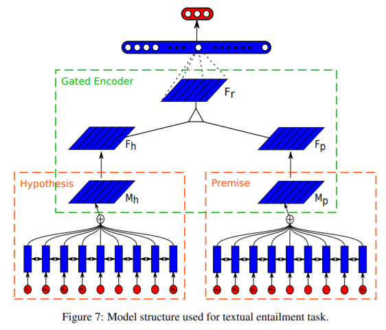
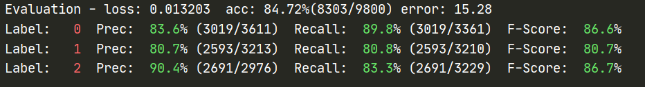

# SelfAttnSent.paddle
A PaddlePaddle implementation of A Structured Self-attentive Sentence Embedding.

## Introduction



论文: [A Structured Self-attentive Sentence Embedding](https://arxiv.org/pdf/1703.03130v1.pdf)

## Results

| Datasets | Paper accuracy | Our accuracy | abs. improv. |
| -------- | -------------- | ------------ | ------------ |
| SNLI     | 84.4           | 84.72        | 0.32         |

## Requirement

- Python >= 3
- PaddlePaddle >= 2.0.0
- see `requirements.txt`

## Usage

### Train
1. 下载数据集到 `data/raw` 文件夹，下载`GloVe`预训练向量，并在`config/snli_preprocess.json`中配置路径，运行`preprocess.py`
```shell
python preprocess.py
```

2. 开始训练
```shell
bash train.sh
```

### Download Trained model

[SNLI model](https://drive.google.com/file/d/1_1EMI4FjpdET9RYVyeHJHUQJBZ8o7ySY/view?usp=sharing)

将模型放置于 `output` 目录下，如下运行 `eval` bash 脚本即可测试模型。

### Test

```shell
bash eval.sh
```

可以得到如下结果：



## Detail

### 与上次提交的区别

1. 采用 lowercase、跳过标点的处理，与原文匹配。
2. 增加了端到端的训练脚本。
3. 增加了训练日志。

### 训练细节

首先冻结 embedding 训练 9 轮，随后在验证集最佳模型的基础上继续训练到 10 轮，选择验证集最佳模型进行最终的评估。

训练日志同时记录了验证集表现和测试集表现。

对于原论文与其对应实现设置的冲突之处，我们选择参考后者。

## References
```bibtex
@misc{lin2017structured,
      title={A Structured Self-attentive Sentence Embedding}, 
      author={Zhouhan Lin and Minwei Feng and Cicero Nogueira dos Santos and Mo Yu and Bing Xiang and Bowen Zhou and Yoshua Bengio},
      year={2017},
      eprint={1703.03130},
      archivePrefix={arXiv},
      primaryClass={cs.CL}
}
```

- https://github.com/hantek/SelfAttentiveSentEmbed